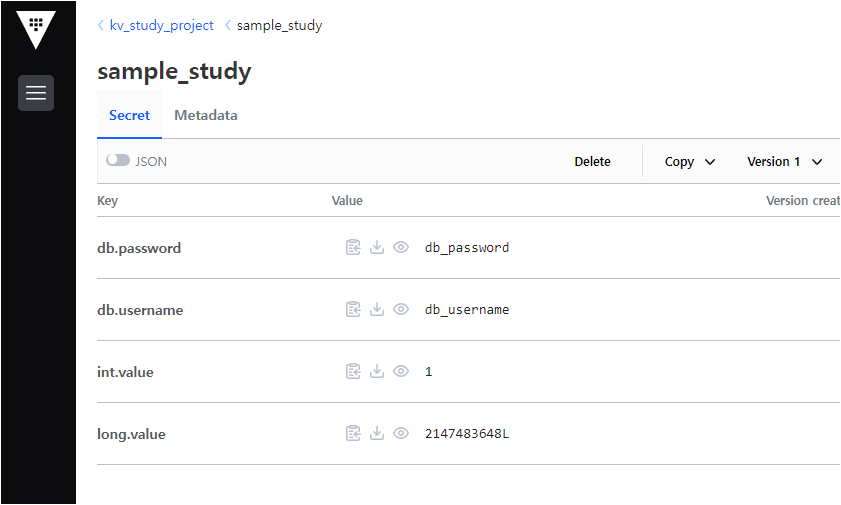

# vault-util

> 토큰 방식으로 아주 간단하게 vault를 읽기만 하는 모듈인데.. 
>
> 차차 개선해나아가자 ~ 😅

## Maven 로컬레파지토리 인스톨

* `publishToMavenLocal` 테스크 실행

  ```sh
  gradle clean test publishToMavenLocal
  ```

* 위 명령을 실행하면 Maven 로컬 레파지토리에 `vault-util` 라이브러리가 설치된다.

* https://docs.gradle.org/current/userguide/publishing_maven.html

  

## 사용처 프로젝트에서 적용 방법

* build.gradle

  ```groovy
  repositories {
    mavenLocal()  // maven 로컬 레파지토리 추가
    mavenCentral()
    ...
  }
  ...
  
  dependencies {
    ... // 모듈의 디펜던시 추가
    implementation 'org.fp024.util:vault-util:0.0.1-SNAPSHOT'
    ...
  }
  ```

  

* **테스트를 위해서 vault 서버에 값을 미리 넣어놨다.**

  

  